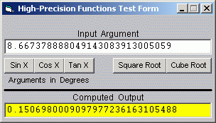



## Higher Precision math

### Description

Some basic high-precision math functions

This little program demonstrates the ability of VB to

go beyond the built-in 16 digit level of precision.

It demonstrates the computation of the sine, cosine,

tangent, square root and cube root of an argument

to a precision of up to 28 significant digits.

In my work, I often encounter special situations where

a higher level of precision is required, so I thought I'd

share some of the basic routines I use to achieve it.
 
### More Info
 
Computes high precision sines, cosines, tangents, square roots and cube roots.

             |
---                |---
**Submitted On**   |2001-02-16 00:15:36
**By**             |[Jay Tanner](https://github.com/Planet-Source-Code/PSCIndex/blob/master/ByAuthor/jay-tanner.md)
**Level**          |Intermediate
**User Rating**    |4.5 (18 globes from 4 users)
**Compatibility**  |VB 6\.0
**Category**       |[Math/ Dates](https://github.com/Planet-Source-Code/PSCIndex/blob/master/ByCategory/math-dates__1-37.md)
**World**          |[Visual Basic](https://github.com/Planet-Source-Code/PSCIndex/blob/master/ByWorld/visual-basic.md)
**Archive File**   |[CODE\_UPLOAD150422162001\.zip](https://github.com/Planet-Source-Code/jay-tanner-higher-precision-math__1-21048/archive/master.zip)

